# YesBill Mobile — Android App

> Track household services, auto-generate monthly bills, and chat with AI about your spending — all from your Android phone.

YesBill makes it effortless to manage recurring household expenses like milk, newspapers, tiffin, cleaning, and internet. Mark daily deliveries in one tap, let AI generate your monthly bill, and pay with a single swipe.

---

## What You Can Do

- **Track deliveries daily** — one tap marks a service as delivered, skipped, or pending
- **Auto-generate bills** — YesBill calculates your monthly total automatically; no spreadsheets
- **Pay & record instantly** — mark bills as paid and choose your payment method (UPI, cash, card, etc.)
- **Export as PDF or text** — share bills with your service provider via WhatsApp or email
- **Chat with AI** — ask "How much did I spend on milk this month?" in plain language
- **AI Agent mode** — let the AI mark deliveries and answer complex questions on your behalf
- **Spending analytics** — beautiful charts showing trends, service breakdowns, and comparisons
- **Smart reminders** — get notified when to tick a service or when a bill is ready
- **Works everywhere** — changes sync instantly between the Android app and the web dashboard

---

## Screenshots

<table>
<tr>
  <td align="center">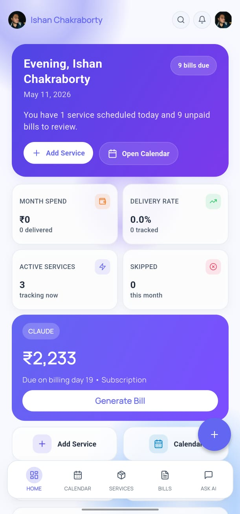<br/><sub>Dashboard</sub></td>
  <td align="center">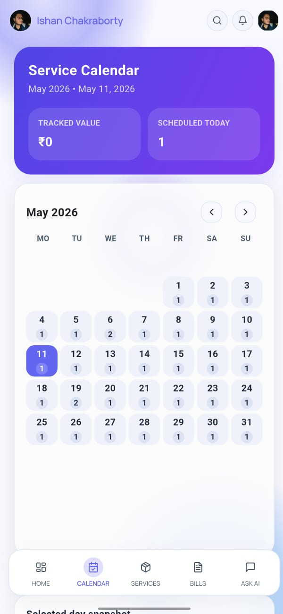<br/><sub>Calendar</sub></td>
  <td align="center">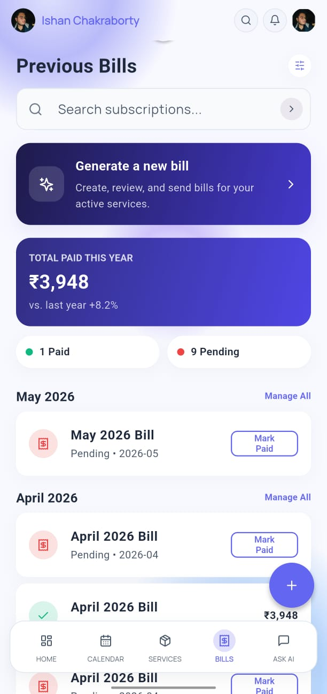<br/><sub>Bills</sub></td>
  <td align="center">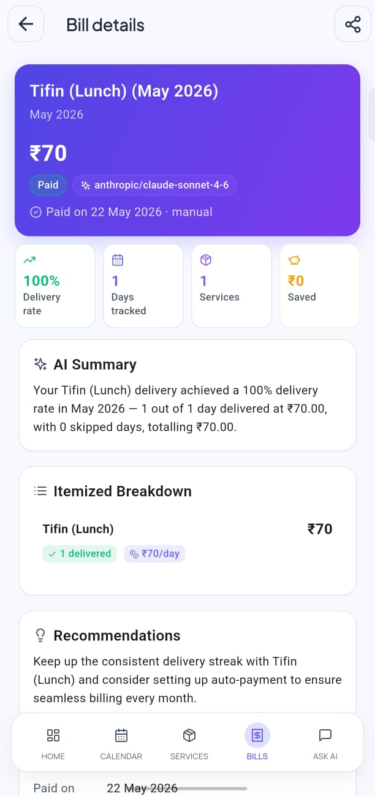<br/><sub>Bill Details</sub></td>
</tr>
<tr>
  <td align="center">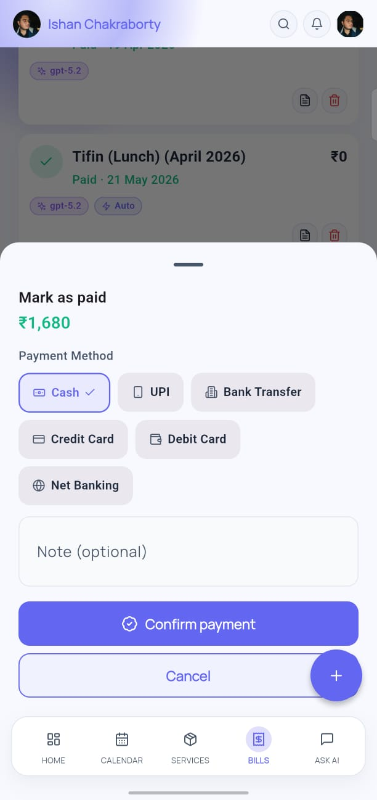<br/><sub>Mark as Paid</sub></td>
  <td align="center">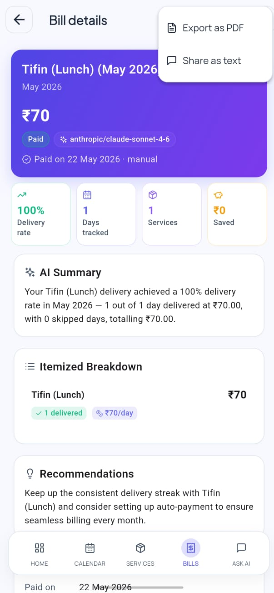<br/><sub>Export Bill</sub></td>
  <td align="center">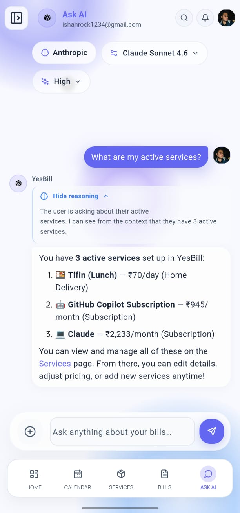<br/><sub>Ask AI</sub></td>
  <td align="center">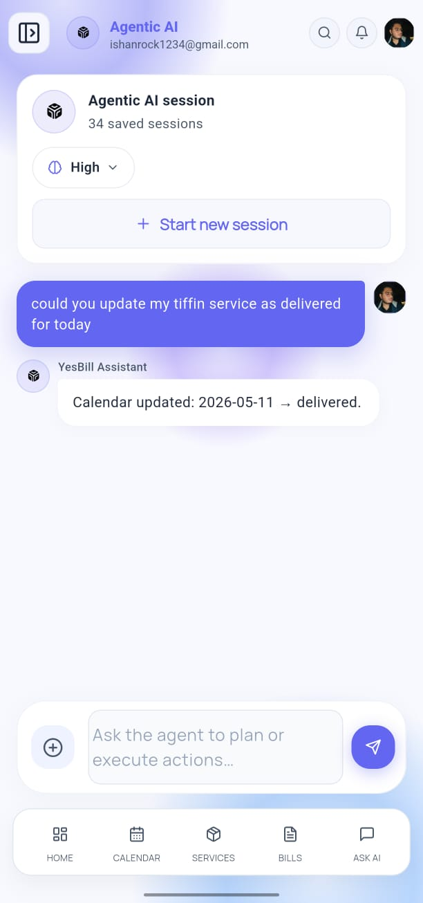<br/><sub>Agentic AI</sub></td>
</tr>
<tr>
  <td align="center">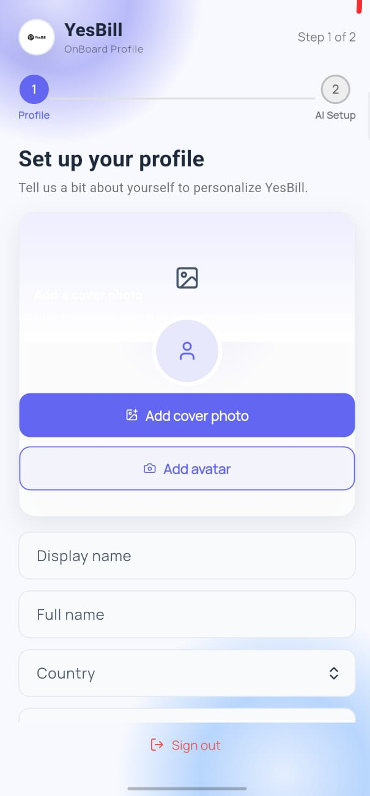<br/><sub>Onboarding Profile</sub></td>
  <td align="center">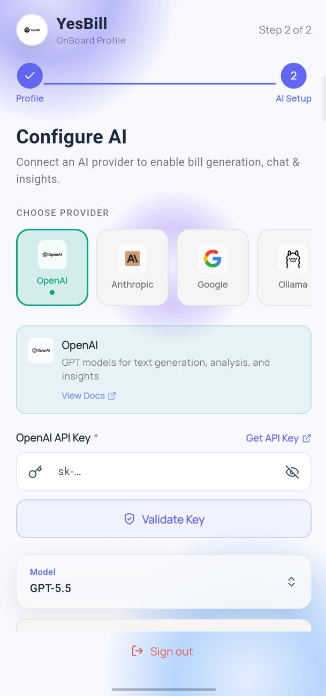<br/><sub>AI Config Setup</sub></td>
  <td align="center"><br/><sub>Analytics</sub></td>
  <td align="center">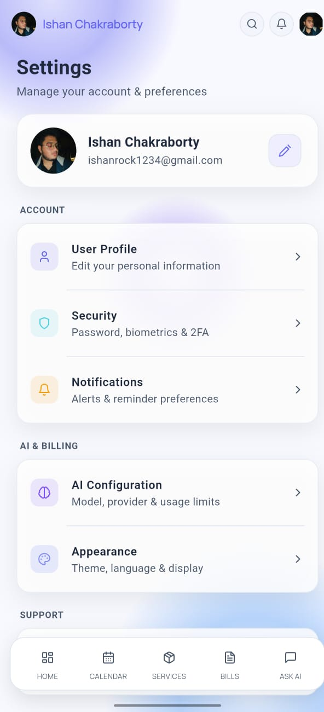<br/><sub>Settings</sub></td>
</tr>
</table>

---

## Download & Install

1. Go to the [**Releases**](https://github.com/Ishan96Dev/YesBill/releases/latest) page and download `YesBill.apk`.
2. On your Android phone, open the downloaded file.
3. If prompted, allow **Install from unknown sources** (Settings → Security → Unknown apps).
4. Tap **Install** and open the app.

> Requires Android 6.0 (Marshmallow) or higher · ~30 MB · Internet required for sync & AI

---

## Getting Started

### 1. Create your account

Open the app → tap **Create Account** → enter your name, email, and password → verify your email. You can also sign in with **Google** for one-tap access.

### 2. Complete onboarding

- **Profile**: Set your timezone and currency — this affects all billing calculations.
- **AI Provider**: Add an API key from [OpenAI](https://platform.openai.com/api-keys), [Anthropic](https://console.anthropic.com/settings/keys), or [Google AI](https://aistudio.google.com/apikey) to unlock AI features. You can skip this and add it later from Settings.

### 3. Add your services

Tap **Services** in the bottom navigation → tap **+** → fill in the service name, type, rate, and start date.

| Example Service | Type | Rate |
|----------------|------|------|
| Morning Milk | Home Delivery | Rs.25 / litre |
| Newspaper | Home Delivery | Rs.5 / day |
| Internet | Utility | Rs.999 / month |
| Maid | Visit-based | Rs.150 / visit |

### 4. Track deliveries daily

Tap **Calendar** → select today → tap each service to mark it **Delivered**, **Skipped**, or leave it **Pending**.

### 5. Generate your bill

Tap **Bills** → **Generate Bill** → select the month → tap **Generate**. YesBill calculates totals and writes an AI summary with spending insights.

### 6. Pay and export

Open a bill → tap **Mark as Paid** → choose your payment method. Tap the share icon to export as **PDF** or send as **text** via WhatsApp or email.

### 7. Ask AI about your spending

Tap **Ask AI** or the Sparkles agent button and type questions like:
- *"Which service cost the most in April?"*
- *"How many days did I get milk this month?"*
- *"Compare my spending between March and April"*

---

## Features at a Glance

| Feature | Description |
|---------|-------------|
| Daily Tracking | One-tap calendar for each service |
| Auto Monthly Bills | AI-powered calculation and plain-language summary |
| Bill Export | PDF and plain text, ready to share |
| Pay & Record | Payment method picker with history |
| Ask AI Chat | Natural-language queries about your data |
| AI Agent | Autonomous mode — AI can take actions on your behalf |
| Analytics | Spending trends, breakdown charts, year-over-year |
| Dark Mode | Follows system appearance automatically |
| Biometric Lock | Unlock with fingerprint or face ID |
| Real-Time Sync | App and web dashboard stay in sync instantly |
| Notifications | Bill reminders and delivery alerts |
| Multi-Provider AI | OpenAI, Anthropic, Google AI, Ollama |

---

## System Requirements

| Requirement | Minimum |
|-------------|---------|
| Android | 6.0 (Marshmallow) or higher |
| Storage | ~30 MB free |
| Internet | Required (sync and AI features) |
| AI features | API key from OpenAI / Anthropic / Google AI (or Ollama locally) |

---

## Docs & Support

- Full user guide: [yesbill.vercel.app/docs/mobile](https://yesbill.vercel.app/docs/mobile/intro)
- Changelog: [CHANGELOG.md](../CHANGELOG.md)
- Issues / feedback: [GitHub Issues](https://github.com/Ishan96Dev/YesBill/issues)

---

---

## Developer Reference

> The sections below are for developers building or contributing to YesBill Mobile.

---

### Tech Stack

| Layer | Technology |
|-------|-----------|
| UI Framework | Flutter 3.41.6, Material 3 |
| Design System | Stitch "Soft Minimalism / Ethereal Organizer" |
| Fonts | Plus Jakarta Sans (headings), Manrope (body) via google_fonts |
| State | flutter_riverpod 2.5.x |
| Navigation | go_router 14.x with ShellRoute + AppScaffold |
| HTTP + SSE | Dio + native dart:io SSE for streaming AI responses |
| Database | Supabase (direct realtime .stream()) |
| Auth | Supabase Auth, Google OAuth, local_auth biometrics |
| AI Providers | OpenAI, Anthropic, Google AI (BYOK), Ollama |
| PDF | pdf + printing + share_plus |
| Notifications | Firebase Cloud Messaging |
| Charts | fl_chart |
| Animations | flutter_animate 4.5.x |
| Icons | lucide_icons 0.257.x |

For architecture details, see [docs/architecture.md](docs/architecture.md).

---

### Prerequisites

| Requirement | Version |
|-------------|---------|
| Flutter SDK | >= 3.41.6 (stable channel) |
| Dart SDK | >= 3.3.0 |
| Java / JDK | >= 17 |
| Android SDK | API 33+ target, API 21+ minimum |

Set JAVA_HOME to your JDK root, e.g.:
```
JAVA_HOME=C:\Program Files\Android\Android Studio\jbr
```

---

### Setup

#### 1. Clone & install dependencies

```powershell
cd yesbill-mobile
flutter pub get
```

#### 2. Configure environment

Copy `.env.example` to `.env` and fill in your values:

```powershell
Copy-Item .env.example .env
```

Edit `.env`:

```env
SUPABASE_URL=https://your-project.supabase.co
SUPABASE_ANON_KEY=your-supabase-anon-key
API_BASE_URL=https://your-backend-url.example.com
GOOGLE_WEB_CLIENT_ID=   # optional
```

Values are injected at build time via `--dart-define`. The app reads them through `AppConfig` — if a key is missing, that feature is silently disabled.

#### 3. Firebase (optional — for push notifications)

Place `google-services.json` in `android/app/`.

---

### Running the App

```powershell
# Run on connected device / emulator (debug)
flutter run

# Run with verbose output
flutter run -v

# Run on a specific device
flutter devices                      # list devices
flutter run -d <device-id>
```

---

### Building the APK

#### Option 1 — Build script (recommended)

Use the build script — it reads `.env` and passes all dart-define flags automatically:

```powershell
# From yesbill-mobile/

# Debug APK (default)
.\tools\build-apk.ps1

# Release APK
.\tools\build-apk.ps1 -Release

# Both debug and release
.\tools\build-apk.ps1 -Both
```

#### Option 2 — Manual terminal commands

Run these from `yesbill-mobile/` with Flutter in your PATH:

```powershell
# 1. Clean previous build artifacts
flutter clean

# 2. Get dependencies
flutter pub get

# 3. Remove any old APKs
Remove-Item "build\app\outputs\flutter-apk\*.apk" -Force -ErrorAction SilentlyContinue

# 4. Build release APK
flutter build apk --release

# 5. Rename to YesBill.apk
Rename-Item "build\app\outputs\flutter-apk\app-release.apk" "YesBill.apk"
```

Output:

```text
build\app\outputs\flutter-apk\app-debug.apk
build\app\outputs\flutter-apk\app-release.apk
build\app\outputs\flutter-apk\YesBill.apk
```

See [docs/release.md](docs/release.md) for signing setup and Play Store bundle instructions.

---

### Code Quality

```powershell
flutter analyze          # lint and type check
flutter format lib/      # format Dart files
flutter test             # run tests
```

---

### Project Structure

```text
lib/
+-- core/
|   +-- config/          # Environment & app configuration
|   +-- theme/           # AppColors, AppTextStyles, AppSpacing
|   +-- utils/           # Validators, formatters, helpers
+-- data/
|   +-- datasources/     # Remote (Supabase, FastAPI) & local data sources
|   +-- models/          # Freezed data models
|   +-- repositories/    # Repository pattern implementations
+-- providers/           # Riverpod providers (state management)
+-- presentation/
    +-- screens/         # Auth, Dashboard, Calendar, Services, Bills, AI, Settings
    +-- widgets/common/  # Shared widgets (AppDropdown, AppScaffold, etc.)
```

- Architecture: [docs/architecture.md](docs/architecture.md)
- Navigation routes: [docs/navigation.md](docs/navigation.md)
- Auth flow: [docs/authentication.md](docs/authentication.md)
- AI streaming: [docs/ai-streaming.md](docs/ai-streaming.md)
- Theming: [docs/theming.md](docs/theming.md)
